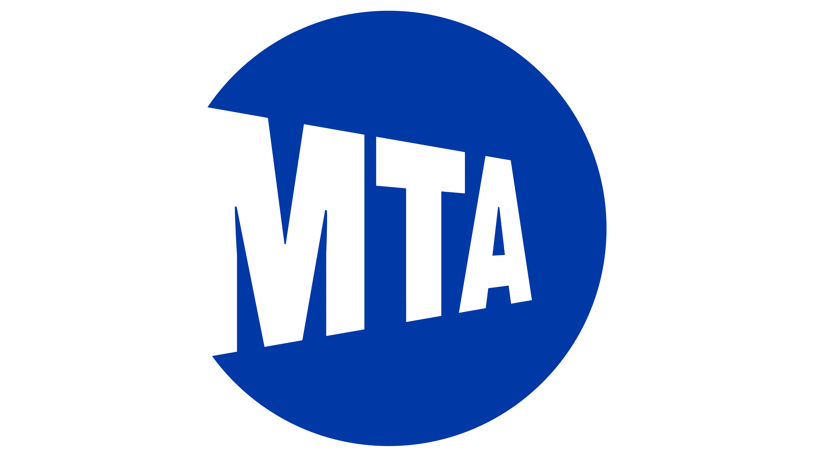

   

# MTA Daily Ridership Data Analysis Project
## Group 3 Members (CLS ONL2_DAT2_G2) 
- Ahmed Mohamed El-Sayed
- Ahmed Sherif Ahmed
- Amer Ahmed Soliman
- Ebtsam Emam El-Sayed
 ### Overview 
This project analyzes the daily ridership of the Metropolitan Transportation Authority (MTA) 
across different transit modes, comparing post-pandemic ridership levels to pre-pandemic 
benchmarks. The goal is to identify trends, patterns, and insights that can inform 
transportation policies and operational decisions.
### Introduction 
Public transportation is a critical component of urban mobility, and understanding 
ridership trends can help transit authorities make data-driven decisions. The COVID-19 
pandemic significantly impacted transit usage worldwide, including the Metropolitan 
Transportation Authority (MTA) network in New York. This project aims to analyze MTA daily 
ridership data, comparing post-pandemic recovery trends against pre-pandemic levels. 
By examining subway, bus, commuter rail, and other transit services, we aim to uncover 
patterns that can inform infrastructure planning, service adjustments, and policy 
decisions.  
### Objectives 
This project aims to:

- Analyze Ridership Trends: Identify patterns in daily ridership across different 
transportation modes. 
- Compare Pre- and Post-Pandemic Ridership: Evaluate how public transportation 
usage has recovered compared to pre-pandemic levels. 
- Discover Peak Usage Periods: Determine the busiest times and days for different 
modes of transportation. 
- Identify Factors Influencing Ridership: Explore potential correlations between 
ridership changes and external factors such as policy changes, seasonal variations, 
and economic conditions. 
- Provide Data-Driven Insights: Generate meaningful visualizations and insights that 
can help stakeholders, policymakers, and transit planners make informed 
decisions. 
### Data Source and Description 
The dataset used in this analysis is the MTA Daily Ridership Data, which provides daily 
ridership estimates for various MTA-operated transit services. The data includes subway, 
bus, Long Island Rail Road (LIRR), Metro-North, Access-A-Ride, and Bridges and Tunnels 
traffic counts. Additionally, the dataset includes percentage comparisons to equivalent 
pre-pandemic ridership levels. 

Data Collection Methodology 

- Subway and Bus Ridership: Derived from MetroCard and OMNY swipes and taps, 
with estimated cash fare additions. 
- LIRR and Metro-North Ridership: Estimated using a model based on ticket sales. 
- Access-A-Ride Trips: Reflects scheduled trips as an indicator of demand rather 
than completed trips. 
- Bridges and Tunnels Traffic: Based on toll collection system data. 
- Pre-Pandemic Comparison: Uses 2019 monthly averages for non-holiday 
weekdays, Saturdays, and Sundays/holidays.
### Screenshots:
### 1- Dashboard Home

 
 

### 2- Overview

 
 

### 3- Comparison

 
 

### 4- Key Insights

